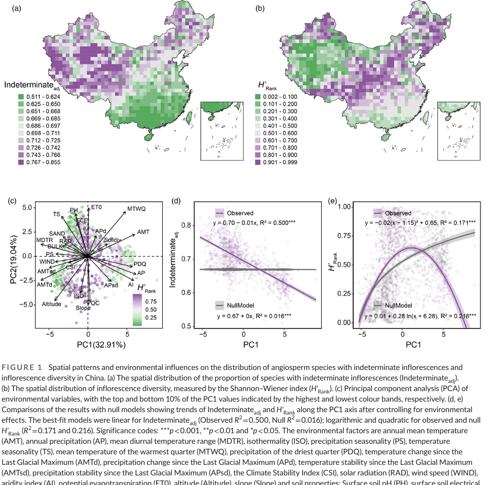
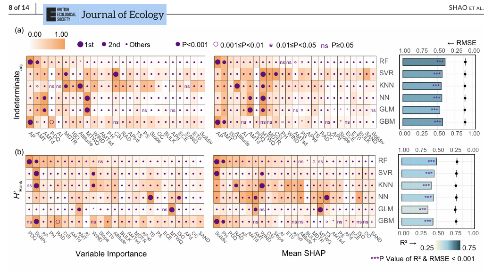
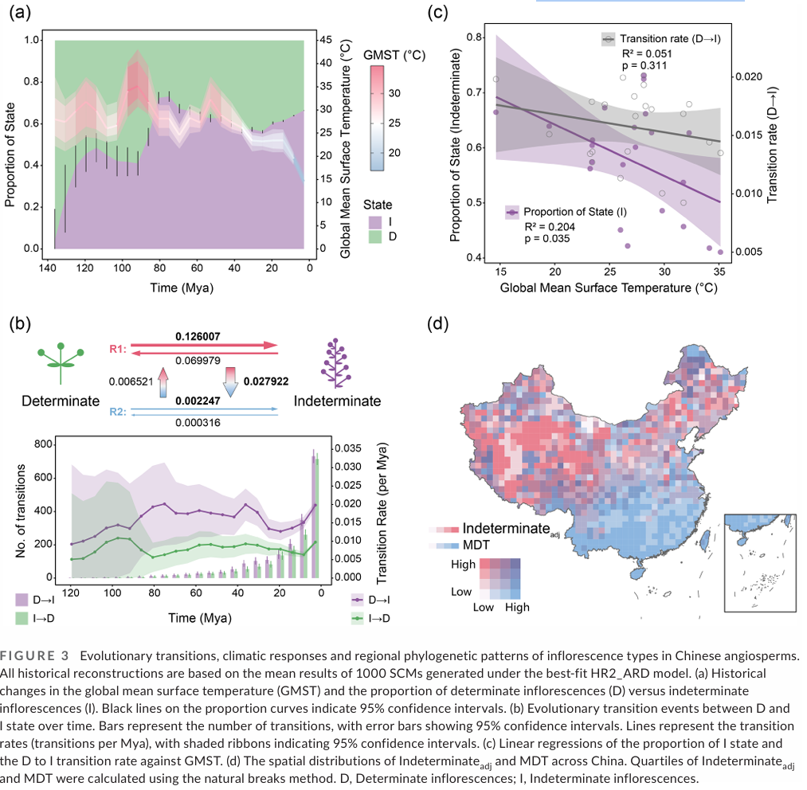
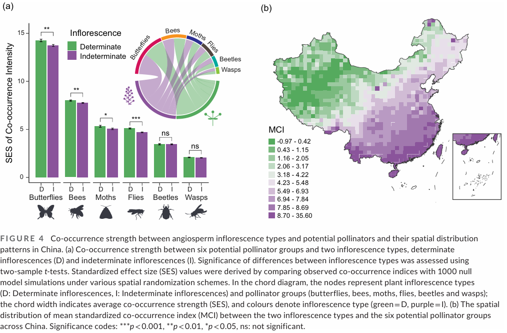
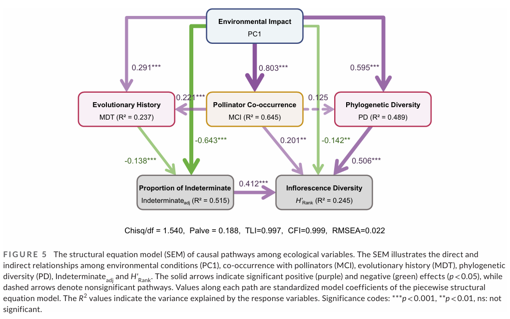

#### 文献阅读笔记

[(Shao et al 2026)](https://besjournals.onlinelibrary.wiley.com/doi/10.1111/1365-2745.70246)

 1. **研究目的**
 **（1）揭示中国被子植物花序多样性的空间格局**    
系统刻画中国尺度上花序类型（尤其是有限花序与无限花序）的地理分布格局，明确不同环境梯度下花序多样性的变化趋势。  
**（2）解析生态与进化因素对花序多样性的综合驱动**   
区分并整合环境过滤、进化历史与植物—传粉者互作三类因素，探讨它们如何共同塑造花序结构的空间分布。  
**（3）检验气候波动与花序进化转变的关系**  
追溯自白垩纪以来花序类型的演化转变，评估全球气候长期变化（特别是降温趋势）是否促进有限花序向无限花序的转变。  
**（4）阐明花序结构与传粉者共现关系**  
从宏生态与宏进化尺度，检验花序类型是否与不同功能类群传粉者的空间共现模式相关。  
2. **研究方法**
**（1）整合大规模物种与性状数据**  
整合约2.5万种中国被子植物的花序类型数据、分布数据以及系统发育信息，构建标准化网格尺度数据库。  
**（2）环境变量与古气候数据分析**  
采用现代气候变量（温度、降水及其季节性）与古气候数据，分析气候稳定性与花序分布之间的关系。  

**（3）多模型机器学习评估变量重要性**  
利用**随机森林、支持向量机、神经网络**等多种机器学习方法，评估环境变量对花序比例与多样性的贡献，并通过SHAP解释变量效应。  

**（4）系统发育重建与祖先状态推断**  
构建系统发育树，利用隐状态马尔可夫模型重建花序祖先状态，计算有限与无限花序之间的转变频率。   

**（5）植物—传粉者共现分析**  
构建植物与六类潜在传粉者的共现矩阵，通过空模型与标准化效应值（SES）检验共现强度。  

**（6）结构方程模型整合路径分析**  
构建结构方程模型（SEM），同时评估环境、系统发育、共现关系与花序多样性之间的直接与间接路径。  

